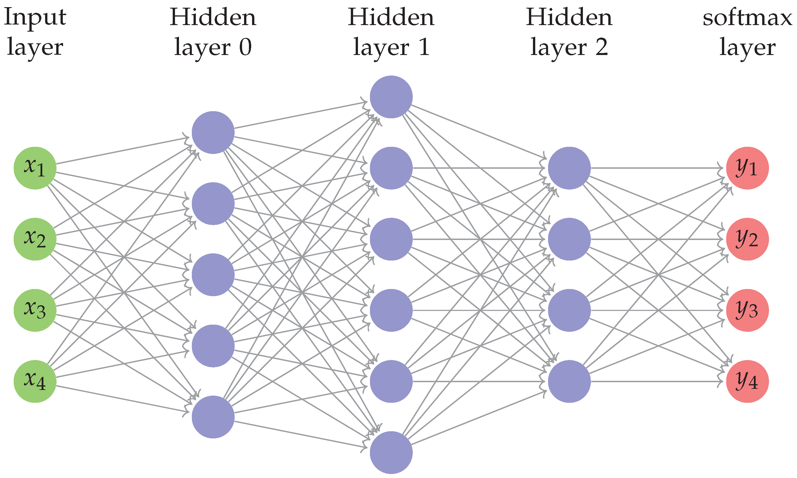

## 2.1 Theoretical Background

Firstly, Softmax Regression is used for multi-class classification, and it is the generalization of Logistic Regression, which can only be used for binary classification.

For each sample $(\textbf{x},\textbf{y})$, where $\textbf{x}$ is the input vector, and $\textbf{y}$ is the output vector. How could $\textbf{y}$ become a vector? Well, in the classification problem, suppose there are $n$ classes, and if the sample belongs to the second class, then $\textbf{y}=[0,1,...0]$, where only the class to which the sample belongs is 1.



The last layer of MLP can be represented as $o=Wx+b$, where $o\in R^n$, and $n$ is the number of classes; $x$ is the output of the last layer; and suppose $x\in R^m$, then $W \in R^{n*m}$, and $b \in R^n$. Now, the issue is, how could we utilize $o$ to decide which class the sample is in? Simple, just use $argmax(o)$(Don't forget that $o$ is a vector, and here we just choose the largest one of the vector). But, we need to learn $o$, that is, we need to define a loss function to be used in Gradient Descent.

Here, we define the Softmax function as:
$$
\hat{y}=softmax(o),  \hat{y}_{i}=\frac{e^{o_{i}}}{\sum_{j} e^{o_{j}}}
$$
where $\hat{y}$ is  our predicting vector, having the same shape as the ground truth vector $y$. If we enter $o$ into the softmax function, the output is a vector of the same dimension. Then what's our optimization object? Suppose the sample belongs to the $i$th. class, then we want the $i$th. value of $\hat{y}$ to be maximized. And we can write the optimization object as 
$$
argmax\prod_{i=1}^{n}\hat{y_{i}}^{y_{i}}
$$
Recall that $y_{i}$ is 1 only in the class it belongs to, so the formula above equals $argmax(\hat{y_{i}})$, which is maximizing the probability that this sample belongs to the right class. But we should avoid $\hat{y}$ to have 0 value, otherwise we may get 0 to the 0th power. To avoid this, we just implement the softmax as 
$$
\hat{y}_{i}=\frac{e^{o_{i}}+\epsilon}{\sum_{j} e^{o_{j}}+n\epsilon}
$$
Then we use the negative logarithm of $\prod_{i=1}^{n}\hat{y_{i}}^{y_{i}}$, so we get our new optimization object:
$$
argmin -\sum_{i=1}^n y_{i}ln(\hat{y_i})
$$
which is also called cross entropy loss.

I want to raise a question here: why do we use softmax instead of just using something like 
$$
\frac{o_{i}}{\sum_{j}o_{j}}
$$
One advantage of softmax is that it is easy to get the derivative:
$$
l(y,\hat{y})=-\sum_{i=1}^n y_{i}ln(\hat{y_i})=-\sum_{i=1}^n y_{i}ln(\frac{e^{o_{i}}}{\sum_{j} e^{o_{j}}})=\sum_{i=1}^n y_{i}ln(\sum_{j}e^{o_{j}})-\sum_{i=1}^n y_{i}o_{i}=ln(\sum_{j}e^{o_{j}})-\sum_{i=1}^n y_{i}o_{i}
$$

$$
\partial_{o_{j}}l(y,\hat{y})=\frac{e^{o_{j}}}{\sum_{i} e^{o_{i}}}-y_{j}=softmax(o_{j})-y_{j}
$$

So we get the gradient of the softmax operation:
$$
\nabla_{o} l(y,\hat{y})=softmax(o)-y
$$

## 2.2 Coding

### 2.2.1 Data Loading

```python
import torch
import torchvision
from torch.utils import data
from torchvision import transforms
from torch import nn

def load_data_fashion_mnist(batch_size, resize=None):
    """Download the Fashion-MNIST dataset and then load it into memory."""
    # Convert the image format from PIL to tensor
    trans = [transforms.ToTensor()]
    if resize:
        trans.insert(0, transforms.Resize(resize))
    trans = transforms.Compose(trans)
    mnist_train = torchvision.datasets.FashionMNIST(
        root="../data", train=True, transform=trans, download=True)
    mnist_test = torchvision.datasets.FashionMNIST(
        root="../data", train=False, transform=trans, download=True)
    return (data.DataLoader(mnist_train, batch_size, shuffle=True),
            data.DataLoader(mnist_test, batch_size, shuffle=False))
```

### 2.2.2 Creating the NN

```python
# PyTorch does not implicitly reshape the inputs. Thus we define the flatten
# layer to reshape the inputs before the linear layer in our network
Softmax=nn.Sequential(nn.Flatten(), nn.Linear(784, 10))
```

Refer to L1 for info about nn.Linear. nn.Flatten flattens `input` by reshaping it into a one-dimensional tensor.

```python
t = torch.tensor([[[1, 2],
                   [3, 4]],
                  [[5, 6],
                   [7, 8]]])
torch.flatten(t)
torch.flatten(t, start_dim=1)
>>tensor([1, 2, 3, 4, 5, 6, 7, 8])
```

How do we implement softmax from scratch?

```python
batch_size = 64

#features of one image
num_inputs=784
num_outputs=10

W=torch.normal(0,0.01,size=(num_inputs, num_outputs),requires_grad=True)
b=torch.zeros(num_outputs, requires_grad=True)

# Input: m * n
# Output: m * n
def softmax(X):
    X_exp = torch.exp(X)
    partition = X_exp.sum(1, keepdim=True)
    return X_exp / partition  # The broadcasting mechanism is applied here

# Input: batch_size * channel * height * width(torch.Size([64, 1, 28, 28]))
# Output: batch_size * num_outputs(torch.Size([64, 10])
def net(X):
    # shape of X.reshape(-1, W.shape[0]): batch_size * num_inputs
    return softmax(torch.matmul(X.reshape(-1,W.shape[0]),W)+b)
```

### 2.2.3 Define Loss Function

```python
loss = nn.CrossEntropyLoss(reduction='none')
# shape of y_hat: batch_size * num_outputs
# shape of y: batch_size * 1
# shape of output: batch_size * 1
l = loss(y_hat, y)
```

When reduction is none, the code above is equivalent to the following code:

```python
# shape of y_hat: batch_size * num_outputs
# shape of y: batch_size * 1
# Output: batch_size * 1
def cross_entropy(y_hat,y):
    l=-torch.log(y_hat[range(len(y_hat)),y])
    return -torch.log(y_hat[range(len(y_hat)),y])
```

What's the meaning of y_hat[range(len(y_hat)), y]? 
range(len(y_hat)) = 0, 1, ..., n-1
y =[$y_{0}$, $y_{2}$, ..., $y_{n-1}$]
where $n$ is the batch_size
so y_hat[range(len(y_hat)), y] = [y_hat[0, $y_{0}$], y_hat[1, $y_{1}$], ..., y_hat[1, $y_{n-1}$]]

What if reduction is not None? Please check [CROSSENTROPYLOSS](https://pytorch.org/docs/stable/generated/torch.nn.CrossEntropyLoss.html) for more information.

But wait, the loss function is a vector? How could pytorch compute gradients, then? The answer could be found in 2.2.6.

### 2.2.4 Compute Accuracy

Accumulator is a utility which will be used later

```python
class Accumulator:
    """For accumulating sums over `n` variables."""

    def __init__(self, n):
        self.data = [0.0] * n

    def add(self, *args):
        self.data = [a + float(b) for a, b in zip(self.data, args)]

    def reset(self):
        self.data = [0.0] * len(self.data)

    def __getitem__(self, idx):
        return self.data[idx]
```

Usage of the Accumulator class:

```python
acc=Accumulator(3)
acc.add(1,2,3)
print(acc.data)
>>[1.0, 2.0, 3.0]
acc.add(3,2,1)
print(acc[0])
>>4.0
```

Then we need to implement the function computing the accuracy of one batch:

```python
def accuracy(y_hat, y):
    """Compute the number of correct predictions of one batch."""
    # in case that y_hat doesn't have axis=1
    if len(y_hat.shape) > 1 and y_hat.shape[1] > 1:
        # select the max element in each row(standing for each sample)
        y_hat = y_hat.argmax(axis=1)
    # Firstly convert the type of y_hat to the type of y
    # Then generate a bool vector, denoting whether the prediction equals the ground truth
    cmp = y_hat.type(y.dtype) == y
    # Add up all the correct predictions
    return float(cmp.type(y.dtype).sum())
```

Finally the function to compute the accuracy of the whole dataset is shown below:

```python
def evaluate_accuracy(net, data_iter):
    """Compute the accuracy for a model on a dataset."""
    if isinstance(net, torch.nn.Module):
        # Set the model to evaluation mode,
        # turning off layers like Dropouts Layers and BatchNorm Layers while evaluating
        net.eval()
    metric = Accumulator(2)  # No. of correct predictions, no. of predictions

    with torch.no_grad():
        for X, y in data_iter:
            # y.numel() means number of elements
            metric.add(accuracy(net(X), y), y.numel())
    return metric[0] / metric[1]
```

### 2.2.5 Define an Optimizer

The optimizer is the same as L1

```python
trainer = torch.optim.SGD(net.parameters(), lr=0.1)
```

Which is like(not exactly the same):

```python
def sgd(params, lr, batch_size):
    """Minibatch stochastic gradient descent."""
    with torch.no_grad():
        for param in params:
            param -= lr * param.grad / batch_size
            #because in pytorch implementation, it's accumulative
            param.grad.zero_()
def updater(batch_size):
    return sgd([W, b], lr, batch_size)
trainer = updater
```

### 2.2.6 Training

```python
# updater is the trainer defined in 2.2.5(please check the full code)
# train_iter has been examined in L1 - Step 1
def train_epoch(net, train_iter, loss, updater):
    """The training loop defined in Chapter 3."""
    # Set the model to the training mode, turning on some layers like dropout and computing gradients
    if isinstance(net, torch.nn.Module):
        net.train()
    # Sum of training loss, sum of training accuracy, no. of examples
    metric = Accumulator(3)
    for X, y in train_iter:
        # Compute gradients and update parameters
        y_hat = net(X)
        # shape of y_hat: batch_size * num_outputs
        # shape of y: batch_size * 1
        # shape of output: batch_size * 1
        l = loss(y_hat, y)
        if isinstance(updater, torch.optim.Optimizer):
            # Using PyTorch in-built optimizer & loss criterion
            updater.zero_grad()
            # Actually, this is equivalent to using reduction = 'mean'(by default) in nn.CrossEntropyLoss
            # that is: loss = nn.CrossEntropyLoss()
            # If using l.backward() here, you will get an error:
            # RuntimeError: grad can be implicitly created only for scalar outputs
            l.mean().backward()
            updater.step()
        else:
            # Using custom built optimizer & loss criterion
            l.sum().backward()
            updater(X.shape[0])
        metric.add(float(l.sum()), accuracy(y_hat, y), y.numel())
    # Return training loss and training accuracy
    return metric[0] / metric[2], metric[1] / metric[2]


def train(net, train_iter, test_iter, loss, num_epochs, updater):
    """Train a model (defined in Chapter 3)."""
    for epoch in range(num_epochs):
        train_metrics = train_epoch(net, train_iter, loss, updater)
        test_acc = evaluate_accuracy(net, test_iter)
        print(f'epoch: {epoch+1}, loss: {train_metrics[0]:2f}, train acc: {train_metrics[1]:2f}, test acc: {test_acc:2f}')
```

## 2.3 Full Code of the Scratch Version

(This version is equivalent to the code outside, but implemented using less pytorch functions)

```python
import torch
import torchvision
from torchvision import transforms
from torch.utils import data

def load_data_fashion_mnist(batch_size, resize=None):
    trans=[transforms.ToTensor()]
    if resize:
        trans.insert(0,transforms.Resize(resize))
    trans=transforms.Compose(trans)
    mnist_train = torchvision.datasets.FashionMNIST(
        root='../data', train=True, transform=trans, download=True)
    mnist_val = torchvision.datasets.FashionMNIST(
        root='../data', train=False, transform=trans, download=True)
    return data.DataLoader(mnist_train,batch_size,shuffle=True),data.DataLoader(mnist_val,batch_size,shuffle=False)

batch_size = 64
train_iter, test_iter = load_data_fashion_mnist(batch_size)

#features of one image
num_inputs=784
num_outputs=10

W=torch.normal(0,0.01,size=(num_inputs, num_outputs),requires_grad=True)
b=torch.zeros(num_outputs, requires_grad=True)

# Input: m * n
# Output: m * n
def softmax(X):
    X_exp = torch.exp(X)
    partition = X_exp.sum(1, keepdim=True)
    return X_exp / partition  # The broadcasting mechanism is applied here

# Input: batch_size * channel * height * width(torch.Size([64, 1, 28, 28]))
# Output: batch_size * num_outputs(torch.Size([64, 10])
def net(X):
    # shape of X.reshape(-1, W.shape[0]): batch_size * num_inputs
    return softmax(torch.matmul(X.reshape(-1,W.shape[0]),W)+b)


# shape of y_hat: batch_size * num_outputs
# shape of y: batch_size * 1
# Output: batch_size * 1
def cross_entropy(y_hat,y):
    l=-torch.log(y_hat[range(len(y_hat)),y])
    return -torch.log(y_hat[range(len(y_hat)),y])

def accuracy(y_hat,y):
    if len(y_hat.shape)>1 and y_hat.shape[1]>1:
        y_hat=y_hat.argmax(axis=1)
    cmp=y_hat.type(y.dtype)==y
    return float(cmp.type(y.dtype).sum())

class Accumulator:
    """For accumulating sums over `n` variables."""
    def __init__(self, n):
        self.data = [0.0] * n

    def add(self, *args):
        self.data = [a + float(b) for a, b in zip(self.data, args)]

    def reset(self):
        self.data = [0.0] * len(self.data)

    # when the user calls it, it's the same as using []
    def __getitem__(self, idx):
        return self.data[idx]

def evaluate_acc(net,data_iter):
    if isinstance(net,torch.nn.Module):
        # turn off layers like Dropouts Layers and BatchNorm Layers while evaluating
        net.eval()
    metric=Accumulator(2)
    for X,y in data_iter:
        metric.add(accuracy(net(X),y),y.numel())
    return metric[0]/metric[1]

def train_epoch(net,train_iter,loss,updater):
    if isinstance(net,torch.nn.Module):
        net.train()
    metric=Accumulator(3)
    for X,y in train_iter:
        y_hat=net(X)
        l=loss(y_hat,y)
        if isinstance(updater,torch.optim.Optimizer):
            #using pytorch in-built optimizer & loss criterion
            updater.zero_grad()
            l.mean().backward()
            updater.step()
        else:
            # using custom buuilt optimizer & loss criterion
            l.sum().backward()
            updater(X.shape[0])
        metric.add(float(l.sum()), accuracy(y_hat, y), y.numel())
    # Return training loss and training accuracy
    return metric[0] / metric[2], metric[1] / metric[2]


def train(net, train_iter, test_iter, loss, num_epochs, updater):  #@save
    """Train a model"""
    for epoch in range(num_epochs):
        train_metrics = train_epoch(net, train_iter, loss, updater)
        test_acc = evaluate_acc(net, test_iter)
        print(
            f'epoch: {epoch + 1}, loss: {train_metrics[0]:2f}, train acc: {train_metrics[1]:2f}, test acc: {test_acc:2f}')


def sgd(params, lr, batch_size):
    """Minibatch stochastic gradient descent."""
    with torch.no_grad():
        for param in params:
            param -= lr * param.grad / batch_size
            #because in pytorch implementation, it's accumulative
            param.grad.zero_()

lr = 0.1

def updater(batch_size):
    return sgd([W, b], lr, batch_size)

num_epochs = 10
train(net, train_iter, test_iter, cross_entropy, num_epochs, updater)
```
